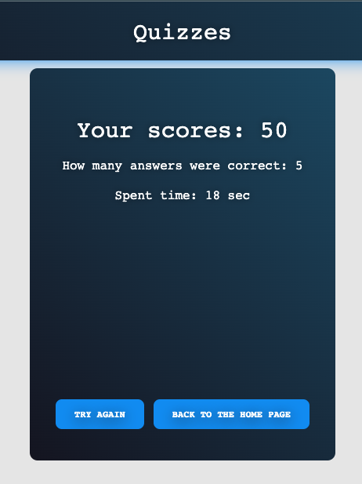

# Quizzes

This project was generated with [Angular CLI](https://github.com/angular/angular-cli) version 16.1.2.

## Functional

- As an app I should have 3 pages - Home (list of quizzes), Play (concrete quiz) and Finish (quiz results).
- As an app I should form 10 quizzes dynamically on the app init by fetching random questions from the data source and organizing them into the quizzes.
- As a quiz item I should display information about: quiz name, how many questions quiz has and play button.
- As a user I should be able to see the button ‘I'm lucky’ on the Home page. It will select a random quiz.
- As a user I should be able to press the button and answer questions on the Play page.
- As a user while playing a quiz I should be able to cancel a quiz and go to the Home page.
- As a user while playing a quiz I should not be able to go to the next questions until I choose some answer.
- As a user after answering the last question I should be navigated to the Finish page and see statistics of how many points I got, how many answers were correct and time it took (+2 statistical options - Up to you).

